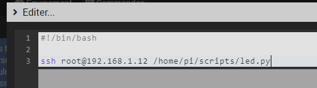

# sshjeedom
SSH script Jeedom

Le but de ce dispositif est de pouvoir executer des scripts depuis une machine distante sur Jeedom, afin d'étayer mes propos, je vais executer un script sur mon serveur OctoPi depuis Jeedom.

Le but sera d'automatiser la connexion SSH via le partage de clés privées, puis de lancer une commande sur le serveur distant lui demandant d'executer le script.

## SSH, clé RSA et partage, sur la machine Jeedom

En SSH et en root, je saisi les commandes suivantes,

### Génération de ma clé privée

``` bash
ssh-keygen -t rsa
cd ~/.ssh
ls
```
Si je vois bien apparaitre ces fichiers, c'est que la génération c'est bien passé :

``` bash
id_rsa  id_rsa.pub  known_hosts
```
*id_rsa correspond à la clé privée, id_rsa.pub est la clé public, c'est elle que nous allons transmettre à notre machine distante*

Puis un peu de sécurité avec

``` bash
chmod 400 ~/.ssh/id_rsa
```


### Partage de ma clé privée

Maintenant que nos clés sont générés, partageons la clé privée, pour ce faire, toujours en SSH sur Jeedom

``` bash
ssh-copy-id root@octopi.local
```

Ici, root correspond au nom d'utilisateur de ma session distante, sur la machine octopi.local (à remplacer par une adresse IP, ou un nom d'hôte suivant votre configuration)


## SSH sur la machine distante

### Vérification de la réception de la clé

``` bash
ls ~/.ssh
```
Vous devriez voir :

``` bash
authorized_keys  known_hosts
```

*Si authorized_keys s'apelle authorized_keys2, veuillez le renommer*

### Modification des droits

``` bash
chmod 700 ~/.ssh
chmod 600 ~/.ssh/authorized_keys 
```

Et voilà, la partie SSH est maintenant terminée, de retour sur Jeedom et en saisissant la commande *ssh root@octopi.local*, ne devrait plus demander de mot de passe et se connecter automatiquement.

## Jeedom et mise en place du script

Sur Jeedom il suffira d'appeler un script via le pluging **Script** demandant à l'hôte distant d'executer son propre script. Dans mon exemple j'ai un script python sur mon OctoPi, me permettant à l'appel d'inverser l'etat d'un GPIO.

Le script est composé de la sorte

``` python
#!/usr/bin/env python3
#-- coding: utf-8 --

import RPi.GPIO as GPIO #Importe la bibliothèque pour contrôler les GPIOs

GPIO.setmode(GPIO.BOARD) #Définit le mode de numérotation (Board)
GPIO.setwarnings(False) #On désactive les messages d'alerte

LED = 7 #Définit le numéro du port GPIO qui alimente la led

GPIO.setup(LED, GPIO.OUT) #Active le contrôle du GPIO

state = GPIO.input(LED) #Lit l'état actuel du GPIO, vrai si allumé, faux si éteint

if state : #Si GPIO allumé
    GPIO.output(LED, GPIO.LOW) #On l’éteint
else : #Sinon
    GPIO.output(LED, GPIO.HIGH) #On l'allume
```

Donc dès que je l'execute il inverse l'un de  mes GPIO. 
Je cherche maintenant son chemin absolue afin de l'executer depuis n'importe ou, */home/pi/scripts/led.py*

Je retourne sur mon Jeedom et je test la commande suivante :

``` bash
ssh root@192.168.1.12 /home/pi/scripts/led.py
```

Il me suffit de créer un script bash sur Jeedom contenant l'entête bash ainsi que ma commande, soit :

``` bash
#!/bin/bash

sudo ssh root@192.168.1.12 /home/pi/scripts/led.py
```

*Attention, le ***sudo*** est très important, cela permettra d'utiliser le partage de clés SSH fait par l'utilisateur root*

## Plugin Script

Première étape : je créer mon équipement


